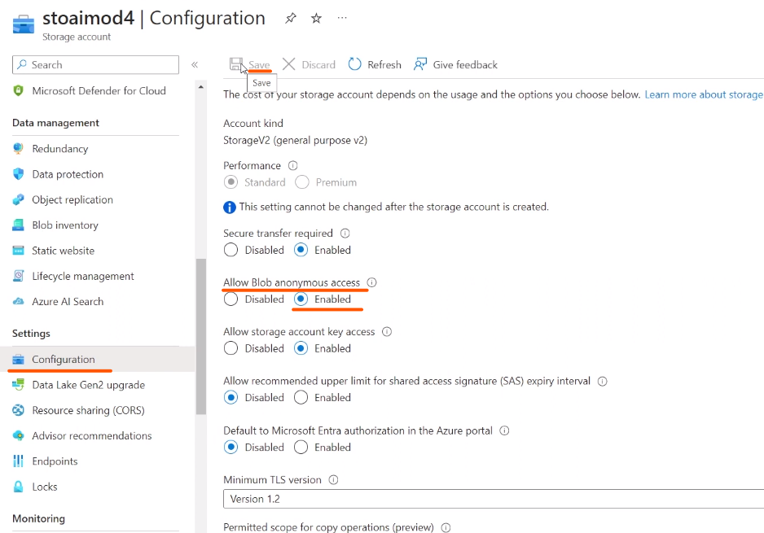

# Soluções de Pesquisa Cognitiva do Azure

ingestão de dados

1. Azure Blob Storage containers
2. Azure Data Lake Storage Gen2
3. Azure Table Storage

**OBS** as questões da prova são mais direcionadas para: o que faz cada
serviço, quando eu preciso resolver esse problema qual o serviço que eu vou
utilizar, esse serviço atende para uma determinada situação, entre outros...

# Passo a passo de como configurar uma pesquisa

Documentação:
https://microsoftlearning.github.io/mslearn-ai-fundamentals/Instructions/Labs/11-ai-search.html

Situação do problema.
Temos uma rede de cafeteria e nós estamos notando algumas reclamações dos
clientes ou daqui a pouco a gente quer saber se as pessoas estão gostando do
serviço que estamos ofertando porque temos unidades em todos os estados do país.

**O que iremos ver:**

Que recurso do azure a gente vai precisar criar para isso.

1. Como vamos extrair esses dados.
2. Como faremos o enriquecimento da ia.
3. Como iremos trabalhar os indices.
4. Consultar essas pesquisas e tudo mais.

O recurso que iremos utilizar é o azure AI Search:

Será necessário criar um novo ai search dando um **nome exclusivo** para ele
e no **Select Pricing Tier** escolha o nível básico (Basic), a localização coloque
**East US**:

Após a finalização

Agora vá em criar um novo recurso (Create a resource) clique em
**AI + Machine Learning** e vá em **Azure AI Service** e clique em Create

Você pode seguir a documentação para configurar essa parte,
após o preenchimento clique em **Review + create**.

Agora nos precisamos criar uma conta de armazenamento:

Clique em **create** na documentação você tera os detalhes para
preenchimento dessa área.

após a criação você terá essa tela de conclusão:
observe que nele você pode armazenar _containers_, _arquivos_, _tabelas_,
_filas_. Então para isso você precisa pré determinar qual recurso está
colocando lá.

Além disso o storage account tem algumas regras de segurança
mas como estamos fazendo um laboratório precisamos quebrar alguma
delas:

## Proximo passo: iremos trazer arquivos para o nosso container

Vamos adicionar um novo container:

**obs: se você está seguindo a documentação o nome sugerido é Coffe-reviews, você deve substituir por coffereviews**

Agora dentro da documentação procure por: 4. In a new browser tab, download the zipped coffee reviews
from https://aka.ms/mslearn-coffee-reviews, and extract the files to the reviews folder.

Aqui você terá o link para baixar os arquivos de reviews após baixar descompacte
a pasta e faça o upload na plataforma:

Agora você deve ir no seu mecanismo de busca criando anteriormente e ir em
**Import Data**

agora selecione onde está o seus dados.

Agora você consegue fazer uma buscar por exemplo por sentimentos negativos:

de uma forma direta você consegue encontrar nomes, sentimentos, palavras chaves,
entre outros. Você consegue ter uma analise do que os clientes estão falando do seu serviço,
isso pode ser implementado por exemplo em um gráfico e ir alimentado **enriquecendo**
com mais dados assim pode ter uma gestão de feedbacks em tempo real completa.

# EXTRAS

## Inteligência de Documentos e Mineração de Conhecimento

Então para escanear um documento exemplo esse:

a gente vai olhar para o que chamamos de **região de interesse** esse são os fatores chaves que iremos configurar.

Alguns modelos pré-construídos no azure:
Faturas
Recibos
Identificador
Reconhecer e extrair pares de valores-chaves
**Essa ferramenta faz parte do Azure Cognitive Search**
